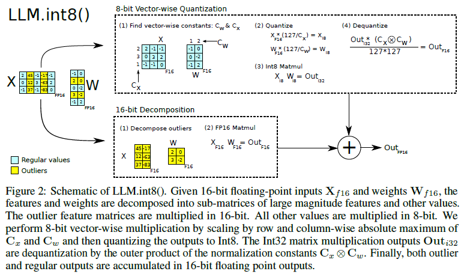

# Quantized 8-bit LLM training and inference using bitsandbytes on AMD GPUs

In this blog post we will cover the bitsandbytes 8-bit representations. As you will see, the bitsandbytes 8-bit representations significantly help reduce the memory needed for fine-tuning and inferencing LLMs. There are many [quantization techniques](https://huggingface.co/docs/transformers/main/quantization/overview) used in the field to decrease a model size, but bitsandbytes offers quantization to decrease the size of optimizer states as well. This post will help you understand the basic principles underlying the bitsandbytes 8-bit representations, explain the bitsandbytes 8-bit optimizer and LLM.int8 techniques, and show you how to implement these on AMD GPUs using ROCm.

## Requirements

[bitsandbytes](https://huggingface.co/docs/bitsandbytes/main/en/index) is a Python wrapper library that offers fast and efficient 8-bit quantization of machine learning models. It is now supported by ROCm 6.2 and can be seamlessly deployed on AMD GPUs. All the demos used in this blog are conducted using the settings detailed below. For comprehensive installation details, please refer to the [ROCm documentation](https://rocm.docs.amd.com/projects/install-on-linux/en/latest/).

* Hardware & OS:
  * [AMD Instinct Accelerator](https://www.amd.com/en/products/accelerators/instinct.html)
  * Ubuntu 22.04.3 LTS
* Software:
  * [ROCm 6.2.0](https://rocm.docs.amd.com/en/latest/)
  * [Pytorch 2.3.0](https://pytorch.org/)
  * Alternately, you can launch a Docker container with the same settings as above.
  
    ``` text
       docker run -it --group-add=video --ipc=host --cap-add=SYS_PTRACE --security-opt seccomp=unconfined --device /dev/kfd --device /dev/dri rocm/pytorch:rocm6.2_ubuntu22.04_py3.10_pytorch_release_2.3.0
    ```

* Install the required libraries.

  ```text
  pip install "transformers>=4.45.1" datasets accelerate "numpy==1.24.4" evaluate
  pip uninstall apex #Hugging Face implements layer fusion without apex 
  ```
  
  (Note that `Apex` needs to uninstalled due to Hugging Face [bug](https://github.com/huggingface/transformers/issues/25491)

* Install `bitsandbytes` as shown below-
  * If you're on AMD Instinct `MI210`/`MI250`/`MI250X`/`MI300A`/`MI300X` GPUs or higher, directly install from wheel package-
  
    ```text
    pip install --no-deps --force-reinstall 'https://github.com/bitsandbytes-foundation/bitsandbytes/releases/download/continuous-release_multi-backend-refactor/bitsandbytes-0.44.1.dev0-py3-none-manylinux_2_24_x86_64.whl'
    ```

  * If you're on older AMD Instinct devices or wish to compile from the source directly, follow below instructions-
  
    ```text
    git clone --recurse https://github.com/ROCm/bitsandbytes
    cd bitsandbytes
    git checkout rocm_enabled
    pip install -r requirements-dev.txt
    cmake -DCOMPUTE_BACKEND=hip -S . #Use -DBNB_ROCM_ARCH="gfx90a;gfx942" to target specific gpu arch
    make
    pip install .
    ```

## Quantization fundamentals

One of the major advantages of quantization is to make large models accessible for training and inferencing on GPUs with smaller memory or fewer GPUs. This is because quantization results in significantly decreased memory footprint that depends on the specific datatype the quantized models use. For example, RoBERTa-Large (355 million) requires ~720 MB GPU memory at half precision (FP16) whereas it requires only ~360 MB when quantized to 8-bit.

Quantization, in the context of ML, involves mapping one representation of numbers to a more compact one, for example from FP32 to INT8. This mapping always results in a loss of information due to the fact that the range and precision of digits covered by FP32 is greater than that of INT8. Note the two terms 'range' and 'precision'. Range refers to the range of values covered (IEEE's int8 range is [-127,127]), while precision refers to the number of digits in the fraction, as defined [here](https://sites.radford.edu/~mhtay/CPSC352/Lecture_PDF/Ch02POCA.pdf). Larger numeric data types generally have a wider range and higher precision.

For example, as shown in the picture below, the original value of `3.1415927` is stored as `3.1415927410` in IEEE-754's FP32 format and `3.140625` in FP16. The different approximations in the representations are due to the varying number of bits assigned to the exponent (pink cells) and mantissa (blue cells) components of both data types. Therefore, when we convert values from one representation to a lower precision one, there is a loss of information.


Image source credits to [Maarten Grootendorst's article](https://www.maartengrootendorst.com/blog/quantization/)

This loss of information accumulates over time in deep learning models and leads to accuracy degradation. This only gets worse when we quantize FP32 weights to INT8 because the latter can only store integers, leading to higher quantization loss. To tackle this, several quantization techniques have been proposed, such as [zero-point quantization](https://www.maartengrootendorst.com/blog/quantization/#asymmetric-quantization) and [absmax quantization](https://www.maartengrootendorst.com/blog/quantization/#symmetric-quantization). Most of these techniques involve normalizing model weights to INT8 using statistical transformations (for example, absmax, min-max, zero point, and scale) followed by rounding off. This yields "good enough" accuracy for inferencing large language models compared to full precision models. You can refer to [this](https://www.maartengrootendorst.com/blog/quantization/) article for a deep dive into the mathematics of quantization.

## 8-bit optimizer by bitsandbytes

Quantization decreases a model's memory consumption during inference, thereby allowing large models such as [OPT-66B](https://huggingface.co/facebook/opt-66b) to fit on a single AMD MI210 GPU. This might not be the case if you want to train the model. Stateful optimizers such as Adam and SGD with momentum maintain state values for every parameter of the model and are used in gradient updates during model training. This results in increased memory requirements of two to three times the model size. For example, Adam has two states consuming 8 bytes per parameter at full precision (32-bits), which sums to 8GB of dedicated memory for a 1B parameters model.

To decrease this memory requirement, bitsandbytes proposed a 8-bit quantization, called [Blockwise Dynamic Quantization](https://arxiv.org/abs/2110.02861), for optimizer states during training. This will decrease Adam states memory consumption from 32 bits to only 8 bits for each state. Yet, using very limited 8-bit range can be challenging for three reasons: quantization accuracy, computational efficiency and large-scale stability. Let's first understand Blockwise Dynamic Quantization with an example before discussing how it addresses these issues.

The quantization process can be described as follows:

* Divide the tensor into blocks of size 4096 or greater (Blockwise).
* Find the local absolute maximum for each block.
* Perform normalization with absmax to reduce the range to [-1,1].
* Find the closest 8-bit value using "Dynamic data type".
* Store the index of this value.

The process of quantization and dequantization is illustrated in the image below.


Image source is [Blockwise Dynamic Quantization paper](https://arxiv.org/abs/2110.02861)

Blockwise quantization reduces the cost of computing normalization by chunking long tensors into small blocks, which means the process is localized to that particular block. This reduces multi-core synchronizations within a GPU and speeds up the process of normalization. Moreover, chunking also helps isolate outliers and achieves **stability and efficiency** in training.

Dynamic quantization proposes a dynamic 8-bit data type to accommodate high-precision and high-magnitude tensor values in the [-1,1] range. This data type, unlike regular FP16/FP32/INT8 data types, doesn't have a fixed number of bits for exponent and fraction components. This non-linearity in the number of bits assigned to each component helps capture extreme values exhibited by optimizer states. As shown in the image below, the first bit serves as a sign bit, while the ensuing string of zeros until the indicator bit, which is the next '1', are for the exponent. The rest of the bits are assigned to the fraction component. This way we can represent an exponent as high as $10^{-7}$ using an 8-bit representation. Compared to other quantization techniques, dynamic quantization has smaller quantization errors for non-uniform distributions, such as optimizer states, which tend to have outliers with values that are orders of magnitude larger than most of the states.


Image source is [8-bit Methods for Efficient Deep Learning with Tim Dettmers video](https://www.youtube.com/watch?v=jyOqtw4ry2w)

Lastly, Blockwise Dynamic Quantization also proposes using a Stable Embedding layer in place of a regular embedding layer for large language models. This includes Xavier uniform initialization, layer normalization before position embeddings, and 32-bit optimizer states. Based on experimental data, the authors found that gradients are higher for the embedding layer. Therefore, to avoid propagating quantization errors, they use 32-bit optimizer states only for this layer.

In summary, Blockwise Dynamic Quantization addresses 8-bit quantization issues effectively as follows:

* Blockwise quantization isolates outliers, achieving stability and efficiency in training large models.
* Dynamic quantization stores float values in a dynamic 8-bit representation. It proposes using a new data type that can fit higher magnitude values as well as high-precision values, yielding low quantization errors.
* The Stable Embedding Layer for large language models improves training stability based on experimental data.

Using 8-bit optimizers for training models significantly cuts down on memory consumption without any accuracy degradation. This is reflected in the difference between training model sizes with and without quantization under the same hardware constraints.


Image source is [Blockwise Dynamic Quantization paper](https://arxiv.org/abs/2110.02861)

We can seamlessly run bitsandbytes' Blockwise Dynamic Quantization on AMD's Instinct GPUs using bitsandbytes' official integration with HuggingFace. Here's the code that trains Google's t5-11B model using the Adam 8-bit optimizer on a single GLUE task named 'cola'. The code is based off of [HuggingFace's example of text classification](https://colab.research.google.com/github/huggingface/notebooks/blob/master/examples/text_classification.ipynb) on GLUE tasks.

```python
from datasets import load_dataset
from evaluate import load
from transformers import AutoTokenizer
from transformers import T5ForSequenceClassification
from transformers import TrainingArguments, Trainer, TrainerCallback
import numpy as np
import bitsandbytes as bnb
import torch
from sys import argv

dataset = load_dataset("glue", data_dir="cola")
metric = load("glue", "cola")
model_checkpoint = "google-t5/t5-3b"

tokenizer = AutoTokenizer.from_pretrained(model_checkpoint, use_fast=True)

def preprocess_fun(examples):
    return tokenizer(examples["sentence"], truncation=True)

dataset = dataset.map(preprocess_fun, batched=True)

model = T5ForSequenceClassification.from_pretrained(model_checkpoint, device_map='cuda', torch_dtype=torch.float16)

train_args = TrainingArguments(
    f"T5-finetuned-cola",
    evaluation_strategy = "epoch",
    save_strategy = "epoch",
    learning_rate=2e-5,
    per_device_train_batch_size=16,
    per_device_eval_batch_size=16,
    num_train_epochs=1,
    load_best_model_at_end=True
)

def compute_metrics(eval_pred):
    predictions, labels = eval_pred
    # print(predictions)
    predictions = np.argmax(predictions[0], axis=1)
    return metric.compute(predictions=predictions, references=labels)

if argv[-1]=='1':
    print("Using bnb's 8-bit Adam optimizer")
    adam = bnb.optim.Adam8bit(model.parameters())
else:
    adam = None # defaults to regular Adam

trainer = Trainer(
    model,
    train_args,
    train_dataset=dataset["validation"],
    eval_dataset=dataset["validation"],
    tokenizer=tokenizer,
    compute_metrics=compute_metrics,
    optimizers = (adam,None)
)
trainer.train()
```

This script can be found [here](./src/optim8bit.py). Before running this model, open a different terminal and monitor the memory consumption using AMD's official [amd-smi](https://rocm.docs.amd.com/projects/amdsmi/en/latest/index.html) tool.

```text
amd-smi monitor -v

GPU  VRAM_USED  VRAM_TOTAL
  0     10 MB    65501 MB
```

Train the model for one epoch on full precision without any quantization and observe the memory footprint of the model, towards the end of training, on the second terminal. It shows 60.5% of memory is occupied.

```text
python optim8bit.py
```

```text
amd-smi monitor -v

GPU  VRAM_USED  VRAM_TOTAL
  0   39671 MB    65501 MB
```

Now, train the model for one epoch with INT8 quantization and observe the memory footprint of the model, towards the end of training, on the second terminal. Only 36% of memory is occupied now.

```text
python optim8bit.py 1
```

```text
amd-smi monitor -v

GPU  VRAM_USED  VRAM_TOTAL
  0   24190 MB    65501 MB
```

As seen in the metrics above, 8-bit optimizers run efficiently, leading to a ~41% decrease in memory requirements on AMD Instinct GPUs.

## LLM.int8() by bitsandbytes

bitsandbytes also presents '[LLM.int8()](https://arxiv.org/abs/2208.07339)', the first multi-billion-parameter scale INT8 quantization procedure for inferencing transformers without any performance degradation. It was the first research to propose quantization for models as large as 175B parameters. The authors observed that scaling INT8 quantization of large language models beyond 1B parameters has failed due to two reasons - lack of *higher quantization precision* and the presence of *emergent features*. They address these two issues in their [LLM.int8 paper](https://arxiv.org/abs/2208.07339) by proposing two changes to a regular quantization - Vectorwise quantization and mixed-precision decomposition.

As seen in the previous section, blockwise quantization employs multiple normalization constants for the same tensor, thereby isolating outlier effects to within the blocks, leading to stable and efficient normalization. Similarly, for matrix multiplication, this paper employs Vectorwise quantization to achieve efficiency by using multiple normalization constants.

Blockwise quantization involves performing quantization independently for rows/columns of a matrix instead of blocks. This makes it less expensive to dequantize the output of a matrix multiplication. For example, take two matrices A and B of size $m \times n$ and $n \times p$. Every element of the output AxB is an inner product of a row from A and a column from B. In Vectorwise quantization, we normalize the row vector by a constant $a$ and the column vector by a constant $b$ and perform the inner product. During dequantization, we can easily recover the value by denormalizing the output by the product of the normalization constants $a \times b$.

The second aspect of LLM.int8(), which is also the core component that enables INT8 quantization of very large models, is mixed-precision decomposition. The authors noticed in their quantitative analysis that quantization errors in large models can accumulate in matrix multiplications, resulting in high magnitude values of up to 20 times larger in certain hidden dimensions. They call these extreme outliers 'emergent features'. These emergent features are the reason for performance degradation of quantized models.

The authors also noted that these emergent features are sparse and very systematic in occurrence, so even Vectorwise quantization alone doesn't help recover models with more than 6.7B parameters (as shown in the picture below). However, LLM.int8() maintains the same accuracy as the 16-bit baseline.


Image source is [LLM.int8 paper](https://arxiv.org/abs/2208.07339)

To support effective quantization, the authors developed the mixed-precision decomposition technique. Firstly, they developed an empirically driven criteria to identify these emergent features. Based on experimental data, they define outliers as features that have a magnitude of at least 6.0 (whereas the normal feature dimension is shown to be in the range [-3.5,3.5], see Table 4 Appendix B), affect at least 25% of layers, and affect at least 6% of the sequence dimensions. Using these criteria, outliers were found in 25% of transformer layers of all models. A phase shift occurs after 6.7B parameters where these emergent features were seen in 100% of the layers.


Image source is from [Finding Outlier Features, Section 4.1, LLM paper](https://arxiv.org/abs/2208.07339)

They identified that these features occur in the hidden dimension (the columns). Zeroing out these features degraded the performance even further, denoting the importance of these features. Quantizing them into INT8 doesn't help either as seen in the orange curve in the above picture. Therefore, they decomposed matrix multiplication into two forms. They used 16-bit matrix multiplication for the outlier columns and 8-bit matrix multiplication for the rest of the elements, then added both results in 16-bit. The combination of Vectorwise quantization and mixed-precision decomposition looks something like this:



Image source is [LLM.int8 paper](https://arxiv.org/abs/2208.07339)

This decomposition not only helps deal with outliers but also achieves stability and better performance when inferencing LLMs. Since 99.9% columns of the Transformer have normal features and less than 1% have outliers, most elements are stored in INT8. This decreases the memory footprint of the model and speeds up inference.

In the code below, we load Facebook's OPT 66B parameter pretrained model on an AMD GPU and quantize it to INT8 using the bitsandbytes config on HuggingFace. We see that the INT8 model fits perfectly into GPU memory, successfully performing inference.

```python
import torch
from transformers import AutoModelForCausalLM, BitsAndBytesConfig, AutoTokenizer

quantization_config = BitsAndBytesConfig(load_in_8bit=True)
tokenizer = AutoTokenizer.from_pretrained('facebook/opt-66b')
model_8bit = AutoModelForCausalLM.from_pretrained(
    "facebook/opt-66b", 
    quantization_config=quantization_config, 
    torch_dtype=torch.float16 # Loads model in float16 and quantizes to INT8 and moves to GPU device
)
print(model_8bit.device)
inp = torch.randint(100,(1,20))
print(model_8bit.generate(inp, max_new_tokens=1))
```

```text
 warnings.warn(
`low_cpu_mem_usage` was None, now set to True since model is quantized.
Loading checkpoint shards: 100%|████████████████████████████████████████████████████████| 14/14 [01:29<00:00,  6.41s/it]
device(type='cuda', index=0)
tensor([[92, 82, 37, 79, 95, 76, 84, 42, 60, 62, 21, 48, 18,  0, 72, 31, 48, 99,
         69, 69,  5]])
```

You can verify the memory consumption using the command ```amd-smi monitor -v```. The model occupies 63.48 GB out of 64 GB, as expected.

```text
GPU  VRAM_USED  VRAM_TOTAL
  0   64908 MB    65501 MB
```

Whereas if you loaded the model in half or full precision on the GPU, you'd run into OOM errors.

```python
import torch
from transformers import AutoModelForCausalLM, BitsAndBytesConfig

model_8bit = AutoModelForCausalLM.from_pretrained(
    "facebook/opt-66b",
    device_map='cuda'
)
```

```text
OutOfMemoryError: HIP out of memory. Tried to allocate 324.00 MiB. GPU
```

## Summary

In this blog, we discussed the fast and efficient 8-bit representations proposed by bitsandbytes that result in a decreased memory footprint for large language models during training and inferencing. The techniques proposed by bitsandbytes, 8-bit optimizer and LLM.int8, are not only memory efficient but also provide stability and efficiency during training, making LLMs more accessible. These techniques include Blockwise quantization, Dynamic quantization, Stable Embedding Layer, Vectorwise quantization and mixed-precision decomposition. Employing these techniques from Hugging Face on AMD GPUs has shown an enormous decrease in memory consumption of around 50%, making AMD's Instinct GPUs advantageous for modern generative AI workloads.

## Disclaimers

Third-party content is licensed to you directly by the third party that owns the content and is
not licensed to you by AMD. ALL LINKED THIRD-PARTY CONTENT IS PROVIDED “AS IS”
WITHOUT A WARRANTY OF ANY KIND. USE OF SUCH THIRD-PARTY CONTENT IS DONE AT
YOUR SOLE DISCRETION AND UNDER NO CIRCUMSTANCES WILL AMD BE LIABLE TO YOU FOR
ANY THIRD-PARTY CONTENT. YOU ASSUME ALL RISK AND ARE SOLELY RESPONSIBLE FOR ANY
DAMAGES THAT MAY ARISE FROM YOUR USE OF THIRD-PARTY CONTENT.
