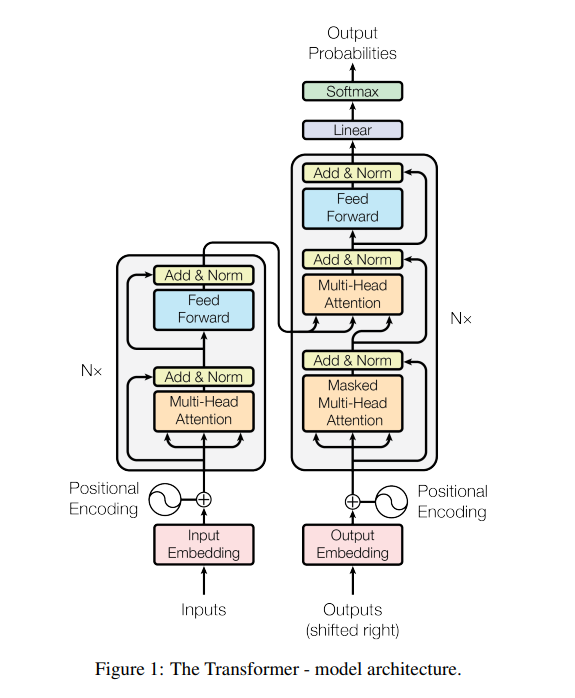

# Transformer based Encoder-Decoder models for image-captioning on AMD GPUs

Image captioning, or the GenAI-based automatic generation of concise textual descriptions of images, has immensely important real-world applications. For example, image captioning can provide visually impaired users with textual descriptions of images for improved accessibility, image captioning can add textual descriptions to products in e-commerce applications and help children map images to their textual descriptions in early childhood educational apps. Image captioning can automatically describe objects and events in security camera footage in surveillance applications and can enable robots to auto-generate textual captions for objects and events they encountered in human-robot interaction (HRI) applications, and many more applications.
Image captioning is a sequence-to-sequence (seq2seq) machine learning task: a model converting a sequence from one domain (in this case, the image), to another (its textual description). In image captioning the image is partitioned into a sequence of patches. This sequence of image patches is then converted by the model to a corresponding sequence of text tokens.

Transfomer-based encoder-decoder models are a popular choice for seq2seq applications such as captioning, transcription, summarization, and translation. Multimodal seq2seq applications bring together two data distributions from different data modalities to identify patterns between them and extract relevant features for the downstream task. These models often consist of a pre-trained encoder and a pre-trained generative decoder which are jointly fine-tuned on a task-specific dataset.

In this blog we provide you with hands-on tutorials on implementing three different Transformer-based encoder-decoder image captioning models using ROCm running on AMD GPUs. The three models we will cover in this blog, ViT-GPT2, BLIP, and Alpha- CLIP, are presented in ascending order of complexity. The first one we discuss, ViT-GPT2, is a simple Transformer encoder-decoder model that is jointly fine-tuned on images and textual data. The second model, BLIP, is a multimodal mixture of models trained to reduce hallucinations and bias in image-based text generation tasks. The third model, Alpha-CLIP, is a CLIP-like model that is fine-tuned to generate region-focused captions. Alpha-CLIP can replace any image encoder in a multi-modal model such as LlaVA to generate rich region-conditioned captions.

Let’s get started and implement image captioning Transformer-based encoder-decoder models on AMD GPUs!

## Setup

This demo was created using the following settings. For more information on installing ROCm, see [ROCm installation for Linux](https://rocm.docs.amd.com/projects/install-on-linux/en/latest/).

* Hardware & OS:
  * [AMD Instinct GPU](https://www.amd.com/en/products/accelerators/instinct.html)
  * Ubuntu 22.04.3 LTS
* Software:
  * [ROCm 6.1.2+](https://rocm.docs.amd.com/en/docs-6.1.2/)
  * [Pytorch 2.1.2](https://pytorch.org/)
  * Alternatively, you can use the following docker command to setup the above software requirements in one go:

    ```docker run -it --rm -p 8080:8080 --device=/dev/kfd --device=/dev/dri --group-add=video --shm-size 8G rocm/pytorch:rocm6.1.3_ubuntu22.04_py3.10_pytorch_release-2.1.2```
  * Clone the [repository assiciated with this blog](.) and install the libraries listed in [requirements.txt](./src/requirements.txt) in the [src folder](./src/).

    ```bash
    git clone https://github.com/ROCm/rocm-blogs.git
    cd rocm-blogs/blogs/artificial-intelligence/image-caption/src
    pip install -r requirements.txt
    ```

  * Install the Hugging Face Accelerate library seperately to avoid conflicts

    ```pip install accelerate```

## ViT-GPT2 Transformer encoder-decoder

Although the idea of training CNN-based vision encoder and RNN-based text decoder jointly for multimodal tasks had been previously explored, [TrOCR: Transformer-based Optical Character Recognition with Pre-trained Models](https://arxiv.org/pdf/2109.10282) was one of the first text recognition models to introduce transformer-based encoder-decoder models. It demonstrated that jointly fine-tuning the models successfully recognized text from an input image. In a typical multimodal Transformer-based encoder-decoder model, the encoder is a Transformer encoder such as ViT, BEiT, or DEiT, and the decoder is a Transformer decoder such as GPT2 or RoBERTa.

To start generating image-based captioning, the image encoder processes the input image once, outputting Q, K, and V values for each image patch. Later, the text decoder is fed with the Begin of Sentence (`BOS`) start token to start generating the image caption. The caption is generated autoregressively, that is to say that the current output is appended to the current input for the next iteration, with the process repeating until either the max length or End of Sentence (`EOS`) token is reached.

The main difference between an Transformer encoder and a Transformer decoder is the way attention is computed. As shown in the image below, the Multi-Head Attention module is used in three different places, each time computing attention differently.



Image source: [Attention Is All You Need](https://arxiv.org/pdf/1706.03762). Encoder on the right, decoder on the left.

The instance of the Multi-Head attention module in the Transformer encoder takes as input the Q, K, and V matrices for attention computation. These three matrices originate either directly from the input, or from the previous layer.

The Masked Multi-Head Attention module in the Transformer decoder masks the tokens to the right of the current token. This enables unidirectional learning so as to avoid attending to token positions that are yet to be predicted. For example, if the input prompt is `The cat is lying on the bed`, `The` will attend only to itself when it is processed and won't attend to the other tokens in the input. This will yield one attention output. Similarly, in the next iteration, `cat` attends to `The` and `cat` but not to the rest of the input prompt. This will yield two attention outputs. The process continues until the end of the prompt is reached. The final attention matrix will look like a lower triangular matrix. Essentially, we obtain this by masking out (zero-ing out) values that aren't needed, hence the name `Masked Multi-Head Attention`.

The Multi-Head Attention module in the decoder performs attention over the encoder outputs and decoder inputs, In other words, the K and V matrices are obatined from the encoder output, and the Q matrix is obtained from the decoder input. This allows for learning from both modalities and produces outputs conditioned on both modalities.

### Implementation

You can use the code below to build a Transformer-based Encoder-Decoder model using Hugging Face's `VisionEncoderDecoder` class. This class initializes a combined model, creating cross-attention layers, performing masked-attention, and loading any pretrained weights. This example uses a combination of ViT and GPT2 pretrained models, with the ViT acting as the encoder and GPT2 acting as the decoder. You can use different encoder-decoder combinations, such as CLIP and GPT, or BEiT and BERT (Hugging Face adds cross-attentional layers to BERT, transforming it from a encoder to a decoder).

Load a [fine-tuned checkpoint](https://huggingface.co/nlpconnect/vit-gpt2-image-captioning) from Hugging Face during model initialization. This checkpoint contains weights fine-tuned on  the COCO 2017 image-text dataset, helping to generate an accurate output caption.

Build a Processor for pre-processing input image and for encoding/decoding text sequences.

```python
from transformers import ViTImageProcessor, GPT2Tokenizer
from transformers import GPT2Config, ViTConfig, VisionEncoderDecoderConfig, VisionEncoderDecoderModel
import requests
from PIL import Image
from matplotlib import pyplot as plt
import torch
import numpy as np

# load input image
image = Image.open('../images/tabby-cat.PNG').convert("RGB")
plt.figure()
plt.imshow(image)

model = VisionEncoderDecoderModel.from_pretrained("nlpconnect/vit-gpt2-image-captioning").to('cuda')
processor = ViTImageProcessor.from_pretrained("nlpconnect/vit-gpt2-image-captioning")
tokenizer = AutoTokenizer.from_pretrained("nlpconnect/vit-gpt2-image-captioning")

pixel_values = torch.Tensor(processor(image, return_tensors="np").pixel_values).to('cuda')
output_ids = model.generate(pixel_values, max_length=128)
preds = tokenizer.batch_decode(output_ids, skip_special_tokens=True)
preds = [pred.strip() for pred in preds]
print(preds)
```


Input image `tabby-cat` taken from [Hugging Face](https://huggingface.co/datasets/huggingface/cats-image).

```bash
['two cats are laying on a blanket on a couch']
```

This caption seems appropriate to the input image shown above.

## BLIP

[Bootstrapping Language-Image Pre-training (BLIP)](https://arxiv.org/pdf/2201.12086) is a multimodal mixture of encoder-decoder models designed to unify two vision-language pretraining tasks: understanding and generation.

Understanding tasks, such as image-text retrieval (ITR), use representational learning to jointly learn the semantics of vision and text modalities.  Generation tasks such as image-captioning and Visual Question Answering (VQA), generate textual data conditioned on an input image. Unifying these two tasks alleviates the need for existing task-specific architectures.

Encoder-based models such as [Contrastive Language-Image Pre-training (CLIP)](https://arxiv.org/pdf/2103.00020) are used for classification tasks whereas encoder-decoder based models such as [VL-BART](https://arxiv.org/pdf/2102.02779) are designed for language-visual reasoning tasks such as captioning. BLIP unifies these two broader tasks in its pretraining strategy using a unique architecture.


BLIP's architecture consists of four transformer-based components:  Image Encoder, Text Encoder, Image-Grounded Text encoder, and Image-grounded Text decoder.


The Text Encoder, Image-Grounded Text encoder, and Image-grounded Text decoder components share parameters for all layers except the self-attention layers. The Image-Grounded Text encoder and Image-grounded Text decoder components also have additional cross-attention layers. Each of these three components operate in three different functionalities, contributing to the overall performance of BLIP.

The Text Encoder component is trained together with the Image Encoder component using the Image-Text Contrastive (ITC) loss function. The ITC loss function rewards positive pairs over negative pairs.

The Image-Grounded Text encoder component is trained using Image-Text Matching (ITM) loss. ITM is a binary classification loss.

The Image grounded Text decoder component is a decoder with cross-attention and masked self-attention layers used for Language Modelling (LM) tasks. It is optimized to maximize the likelihood of text generation in an autoregressive manner. The pretrained mixture of models can then be used for various downstream tasks either for transfer learning or Zero-shot transfer.


Image source: [BLIP: Bootstrapping Language-Image Pre-training for Unified Vision-Language Understanding and Generation](https://arxiv.org/pdf/2201.12086)

During fine-tuning, BLIP generates boostrapped image-text pairs to reduce hallucinations. This is brought about by seperately fine-tuning the Image-Grounded Text Encoder and Image-grounded Text Decoder on a web dataset, such as the COCO dataset. The former acts as a filter to select between a web caption and a synthetic caption. The latter acts as a captioner by facilitating generating a synthetic caption. As with the picture in the BLIP section, the filter chooses between the web caption and the synthetic caption, avoiding hallucinations and bias induced by the captioner.

### Inferencing with BLIP

This section demonstrates how to run inference on Hugging Face's BLIP model on the tabby-cat picture to examine its caption-generation capability. BLIP has a built-in processor and tokenizer, which means that the same processor will be used for both image processing and text decoding.

```python
import torch
from transformers import BlipProcessor, BlipForConditionalGeneration

processor = BlipProcessor.from_pretrained("Salesforce/blip-image-captioning-base")
model = BlipForConditionalGeneration.from_pretrained("Salesforce/blip-image-captioning-base").to("cuda")

image = Image.open('./images/tabby-cat.PNG').convert("RGB")

inputs = processor(image, return_tensors="np")
pixel_values = torch.Tensor(inputs['pixel_values']).to("cuda")

out = model.generate(pixel_values)
print(processor.decode(out[0], skip_special_tokens=True))
```

```bash
two cats sleeping on a pink couch
```

This caption seems appropriate for the input image.

## AlphaCLIP

[Alpha-CLIP](https://arxiv.org/abs/2312.03818) is a fine-tuned version of CLIP that offers region-focused awareness of images. Region-focused awareness generates captions conditioned on a specific region of the image, resulting in finer understanding of the input and more controllable outputs. For example, Alpha-CLIP can help generate a rich and verbose caption describing the subject of a picture, such as a volleyball player or a fish, in an image filled with background details. This region-focused interest is achieved by using an auxiliary convolutional channel added to the CLIP image encoder.


This auxiliary channel accepts a specific region of interest as input through a segmentation mask. While CLIP can summarize the whole image, Alpha-CLIP brings out specific portions of an image as described by the auxiliary input.


Image source: [Alpha-CLIP: A CLIP Model Focusing on Wherever You Want](https://aleafy.github.io/alpha-clip/)
](https://aleafy.github.io/alpha-clip/)

Alpha-CLIP outperforms CLIP on tasks such as image classification, 2D image generation, 3D volume generation, and image captioning. While initiated with CLIP, Alpha-CLIP is trained on millions of RGBA region-text pairs while keeping the CLIP text encoder static. Alpha-CLIP employs a series of detection models, segmentation, and text generation models to generate a region-text pair dataset for training. Once trained, Alpha-CLIP is able to focus on specified region and assist in downstream tasks such as image captioning.

This blog will focus on Alpha-CLIP's region-focused image captioning capability, which is referred to as Multimodal Large Language Modelling (MLLM) in [Alpha-CLIP: A CLIP Model Focusing on Wherever You Want](https://arxiv.org/abs/2312.03818).

To generate captions, a large language model is needed in addition to Alpha-CLIP. Therefore, during inference a MLLM such as BLIP-2 or Llava will be leveraged, replacing the image encoder with ALpha-CLIP to provide region specificity in caption generation.

Region specific captioning also helps mitigate hallucinations  such as those shown in the image below.


The caption for the left image in the third row hallucinates between objects and colors as is evidenced in the caption "A red telephone on a table" describing a green telephone and red mushroom on a table. The caption changes to "A red mushroom on a table" when the mushroom region is specied, and to "A green telephone on a table" when the telephone-region is specified. The hallucinations are eliminated without the need of extra filters or models.


Image source:  Alpha-CLIP: A CLIP Model Focusing on Wherever You Want
](https://arxiv.org/abs/2312.03818)

Alpha-CLIP code is publicly available and can be accessed on the [SunzeY/AlphaCLIP repository](https://github.com/SunzeY/AlphaCLIP). You can demo the LlaVa-based image-captioner to obtain region focused captions using the following commands:

```text
git clone https://github.com/SunzeY/AlphaCLIP
cd AlphaCLIP/demo/with_llm
python app.py
```

This script downloads model checkpoints and starts a [gradio UI](https://www.gradio.app/) server that hosts the Alpha-CLIP model. Click on the link and upload an image of your choice. Add markup to the region of interest you want the captioner to focus on.

```text
Loading checkpoint shards: 100%|████████████████████████████████████████████████████████████████████████████████████████████████████████████████████| 2/2 [00:03<00:00,  1.71s/it]
clip_l14@336_grit1m_fultune_8xe.pth
IMPORTANT: You are using gradio version 3.37.0, however version 4.29.0 is available, please upgrade.
--------
Running on local URL:  http://0.0.0.0:7860
Running on public URL: https://7787dc476f48e1b8f2.gradio.live

This share link expires in 72 hours. For free permanent hosting and GPU upgrades, run `gradio deploy` from Terminal to deploy to Spaces (https://huggingface.co/spaces)
```

The following example shows the caption for a busy street.


When the white truck is marked up, the caption changes.


## Summary

This blog introduces you to image captioning, a highly applicable seq2seq task used to generate text captions for given images. The blog provides hands-on tutorials on three different Transformer-based encoder-decoder image captioning models: ViT-GPT2, BLIP, and Alpha- CLIP, showing you how to deploy the models on AMD GPUs using ROCm, automatically generating relevant output text captions for given input images.

## Disclaimers

Third-party content is licensed to you directly by the third party that owns the content and is not licensed to you by AMD. ALL LINKED THIRD-PARTY CONTENT IS PROVIDED “AS IS” WITHOUT A WARRANTY OF ANY KIND. USE OF SUCH THIRD-PARTY CONTENT IS DONE AT YOUR SOLE DISCRETION AND UNDER NO CIRCUMSTANCES WILL AMD BE LIABLE TO YOU FOR ANY THIRD-PARTY CONTENT. YOU ASSUME ALL RISK AND ARE SOLELY RESPONSIBLE FOR ANY DAMAGES THAT MAY ARISE FROM YOUR USE OF THIRD-PARTY CONTENT.
