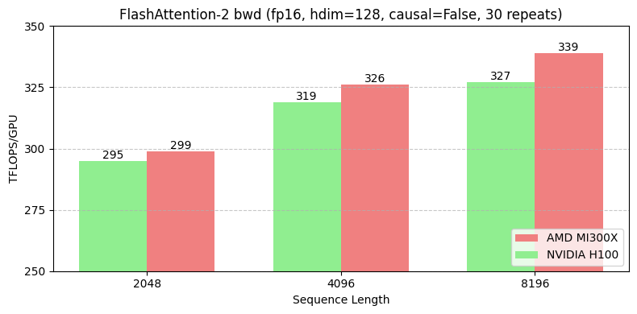
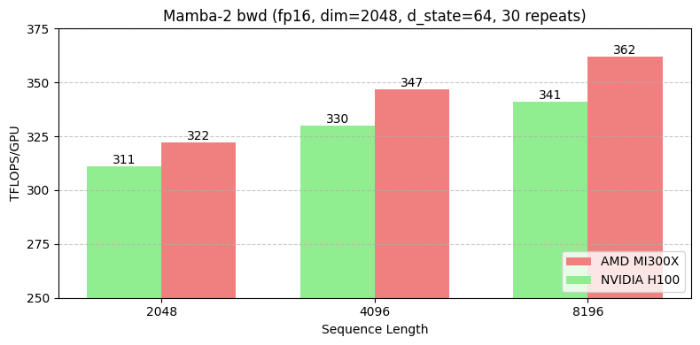

# Training Transformers and Hybrid models on AMD Instinct MI300X Accelerators

This blog is contributed by [Zyphra](https://www.zyphra.com/): a Palo Alto-based AI research lab and AMD Instinct Partner.

Zyphra is designing MaiaOS, a multimodal agent system that combines next-gen neural network architectures (SSM hybrids), long-term memory & reinforcement learning.

In this blog we motivate our vision of training transformers and hybrid models at a lower cost using AMD technology. We explain how Zyphra harnessed the fundamental performance advantages of the MI300x hardware on Zyphra's hybrid models: the Mamba2, and the Flash Attention v2. We conclude the blog by sharing benchmarks results showing the speedups we achieved on the MI300X using ROCm, compared to the competition.
On paper, the AMD Instinct MI300X GPU accelerators contain some of the best hardware specifications on the market. The key hardware specs where the MI300X surpasses its main competitor, the NVIDIA H100 GPU, are High Bandwidth Memory (HBM) capacity and bandwidth.

The MI300X also has significantly more compute hardware at its disposal, with a significantly greater number of streaming multiprocessors (SMs) than the H100. While this leads to incredibly high theoretical BFLOAT16 throughput, there are some caveats in practice that we discuss below.

For exact comparisons, see the table below:

|     | **AMD MI300X** | **NVIDIA H100 SXM** |
| --- | --- | --- |
| **Total Board Power (TBP)** | 750W | 700W |
| --- | --- | --- |
| **HBM3 Quantity** | 192GB | 80GB |
| --- | --- | --- |
| **Memory Bandwidth** | 5.3TB/s | 3.3TB/s |
| --- | --- | --- |
| **SM Count** | 304 | 113 |
| --- | --- | --- |

Despite these impressive specs, however, the Nvidia H100/H200 remains widely adopted for large-scale pretraining runs, (except Google and Apple[\[1\]](#footnote-0), who use TPUs).

This is primarily because, while the MI300X hardware is theoretically very powerful, actually materializing that performance in practice needs additional work, due to the relative nascency of the surrounding software stack compared to NVIDIA’s CUDA ecosystem. The need for any potential MI300X user is to pull this theoretical performance out of the underlying hardware, since many of the kernels inherent to the modern AI ecosystem were built and optimized with implicit (or explicit) assumptions around NVIDIA hardware.

What this means in practice is that many kernels for core operations required in pretraining either do not exist, or are not optimized compared to their H100 counterparts, and this negates the fundamental performance advantages of the MI300x hardware.

While AMDs ROCm software stack provides HIPification[\[2\]](#footnote-1) tools which enable a degree of portability from CUDA to HIP, actually matching or exceeding the performance of a CUDA-optimized kernel in HIP requires additional work.

Kernels are split into the forward pass and the backward pass. The forward pass is significantly simpler than backward, which is partially due to activation recomputation. Many AMD kernels support inference but may lack optimized backward passes needed for training. For instance, the ROCm port of Flash Attention v2 has a highly optimized implementation of the forward pass that slightly beats the NVIDIA H100 in throughput, but the backwards pass still needs more optimization.

These three properties:

1. AMD Instinct MI300X accelerators beefy hardware, which translates to performance potential
2. Kernels being easy to port but hard to optimize
3. Forward-pass kernels being easier to write and optimize, and using the “free lunch” of higher memory bandwidth

Have led to the “train on H100s and infer on MI300X” strategy that many organizations have started to take today. We at Zyphra, however, want to push the boundaries of hardware efficiency so that we can continue training frontier foundation models such as our Zamba2 series of models[\[3\]](#footnote-2) at a lower cost than our competitors, which is where AMD solutions come into play. Therefore, we have been working over the last few months to write and optimize the component backwards kernels that are necessary for our hybrid models (Mamba2 and Flash Attention v2).

## Flash Attention

To discuss the [Flash Attention v2](https://arxiv.org/abs/2307.08691) (FA2) kernel writing process we need to discuss the hardware properties of MI300X and how they affect FA2.

1. First, despite the abundance of compute available on MI300X, the throughput for compute-bound BF16/FP16 GEMMs is roughly on par with H100. The exact GEMM throughput on both architectures is strongly determined by the size of the component matrices which make up the GEMM[\[4\]](#footnote-3). This translates to different attention block sizes (hidden dimension and number of attention heads) being optimal for each hardware. Sizing aside, we believe the peak real-world throughput of the MI300X will continue to increase over time[\[5\]](#footnote-4)
2. Second, the SRAM constraints are very different compared to H100s. MI300X GPUs have 64KB of local data share (LDS) per SM, whereas H100s have 256KB shared memory per SM (split between L1 cache and local memory, only up to 228KB is programmable). Since flash is predicated on fitting blocks as large as possible into SRAM, this makes larger head dimensions difficult on the MI300X.
3. The threads per warp is 64 on MI300X, but 32 on H100, which requires one to rethink work partitioning on the MI300X.
4. Memory bandwidth is significantly higher for MI300X. We didn’t use explicitly redesign our kernel around higher memory bandwidth, but it does improve the speed of moving blocks between HBM and SRAM.

In addition to the full restructuring, we baked in the following AMD-specific optimizations when writing the FA2 backward kernel:

1. Redo work partitioning to account for the new warp size of 64 threads. Ensure shared memory reads and writes are minimized for each block.
2. Tune block sizes and kernel launch parameters to account for the reduced 64KB LDS constraint, and to reduce cache thrashing.
3. Minimized shared memory and cache conflicts via restructured MI300X-specific memory layout
4. Split each block across more warps to further reduce shared memory read/writes, since SMs are more abundant.

The result of this optimization work is that we achieved speedups of 1%, 2%, and 4% for sequence lengths of 2k, 4k, and 8k, respectively for the FA2 backward kernel on MI300X compared to the H100. Cache thrashing, data movement cost, and SM utilization are all significantly improved compared to the initial MI300X port baseline during the attention backward pass when investigated via the ROCm profiling suite. With our attention backwards kernel in-hand, attention-based models such as dense/MoE transformers are trainable efficiently on MI300X hardware and can achieve high MFU.

## Mamba-2

While FlashAttention2-backward is a fundamental kernel necessary for training any transformer models today, at Zyphra we also have been innovating on designing novel model architectures which can achieve both higher quality and significantly greater inference and training performance over vanilla transformers.

Specifically, we have been designing and optimizing architectures based around hybrids of transformers and state-space-models (SSMs) such as Mamba. We find that such hybrids significantly outperform transformers both in terms of quality (loss per parameter) and also inference efficiency.

However, this architecture necessitates additional effort to port and optimize Mamba-2 kernels to the AMD ecosystem. Mamba2 kernels currently exist in Triton but are optimized for NVIDIA H100 GPUs. The same hardware properties we discussed above in the [Flash Attention](#_1aetickg5j2l) section hold for Mamba-2 backward kernel development.

We baked in the following AMD-specific optimizations when writing the Mamba-2 backward kernel:

1. Improved shared memory movement and access by arranging the smem_delta_a, smem_running_postfix, smem_da, smem_dbc buffers to better align with MI300X hardware, and within 64KB.
2. Modified prefix scan and reverse scan operations to the MI300X wavefront size. Perform tuning of block sizes and kernel launch parameters similar to FA2 to be optimal on MI300X.
3. Rework the block-exchange for atomicAdds using patterns more amenable to MI300X while maintaining coalescing.

Similar to FA2, we achieve speedups on the Mamba2 backward kernel of 4%, 5%, and 6% for sequence lengths of 2k, 4k, and 8k, respectively on MI300X compared to the H100. Cache thrashing, data movement cost, and SM utilization are all significantly improved. With both the Mamba2 forwards and backwards and the Flash Attention 2 backwards kernel in-hand, pure-SSM and hybrid attention/SSM models are trainable on MI300X hardware, and can achieve higher FLOPs per dollar than is possible on NVIDIA H100 systems.

## Summary

In this blog post we outlined Zyphra’s vision of training transformers and hybrid models at a lower cost. We explain how Zyphra is realizing this vision by optimizing the superior hardware specifications of the AMD Instinct MI300X Accelerators, using ROCm to train Zyphra’s hybrid models: the Mamba2 and the Flash Attention v2.

As future work, Zyphra plans to extend the attention kernel and portions of the Mamba2 kernel to fp8 precision, and enable fine-grained tensor-parallel overlap within the Mamba2, Attention, and MLP blocks with communication. Both optimizations are critical to Zyphra’s training pipeline.

As future work, we plan to extend the attention kernel and portions of the Mamba2 kernel to fp8 precision, and enable fine-grained tensor-parallel overlap within the Mamba2, Attention, and MLP blocks with communication. Both optimizations are critical to Zyphra’s training pipeline.

## Acknowledgements

Zyphra would like to thank TensorWave, Cirrascale, and AMD for providing us with access to AMD Instinct MI300X GPU accelerators to carry out the optimizations in this work.

1. <https://arxiv.org/abs/2407.21075> [↑](#footnote-ref-0)

2. HIP is the GPU programming language equivalent to CUDA used on AMD GPUs [↑](#footnote-ref-1)

3. Zamba2-[7B](https://www.zyphra.com/post/zamba2-7b), [2.7B](https://www.zyphra.com/post/zamba2-small), and [1.2B](https://www.zyphra.com/post/zamba2-mini) [↑](#footnote-ref-2)

4. See <https://arxiv.org/abs/2401.14489> for explanations and examples of this effect [↑](#footnote-ref-3)

5. We believe this is due to power-management firmware, which will improve over time and already has since we started working with MI300X. See <https://fireworks.ai/blog/fireattention-v3> and <https://github.com/stas00/ml-engineering/blob/master/compute/accelerator/README.md#maximum-achievable-matmul-flops-comparison-table> for further discussion. [↑](#footnote-ref-4)

## Disclaimers

Third-party content is licensed to you directly by the third party that owns the content and is not licensed to you by AMD. ALL LINKED THIRD-PARTY CONTENT IS PROVIDED “AS IS” WITHOUT A WARRANTY OF ANY KIND. USE OF SUCH THIRD-PARTY CONTENT IS DONE AT YOUR SOLE DISCRETION AND UNDER NO CIRCUMSTANCES WILL AMD BE LIABLE TO YOU FOR ANY THIRD-PARTY CONTENT. YOU ASSUME ALL RISK AND ARE SOLELY RESPONSIBLE FOR ANY DAMAGES THAT MAY ARISE FROM YOUR USE OF THIRD-PARTY CONTENT.
