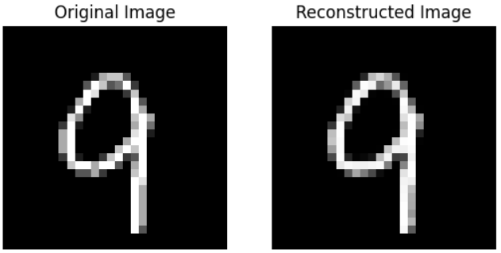
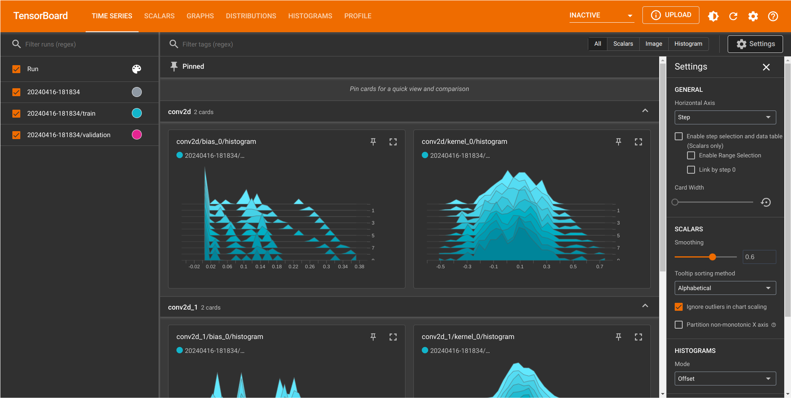
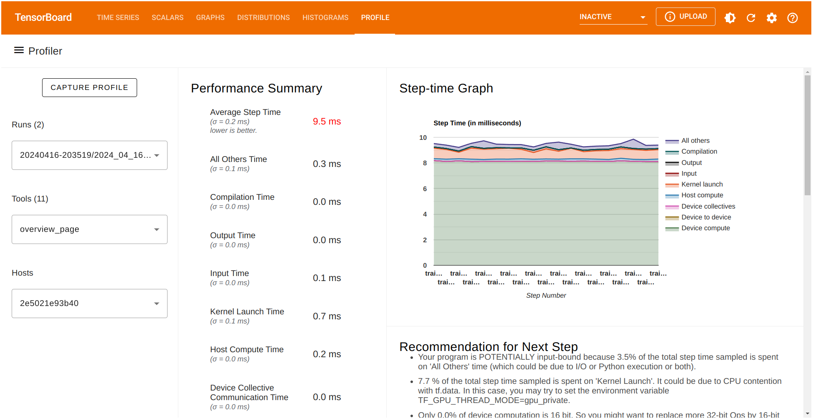
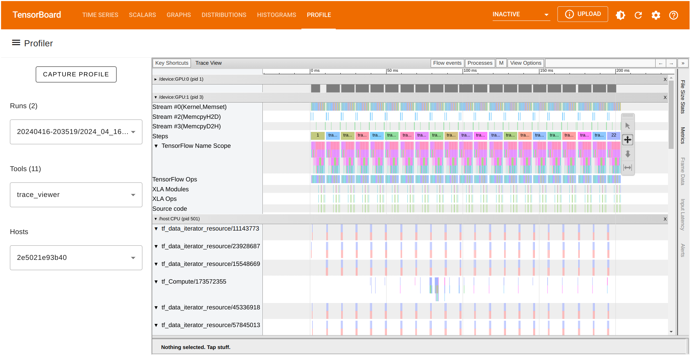
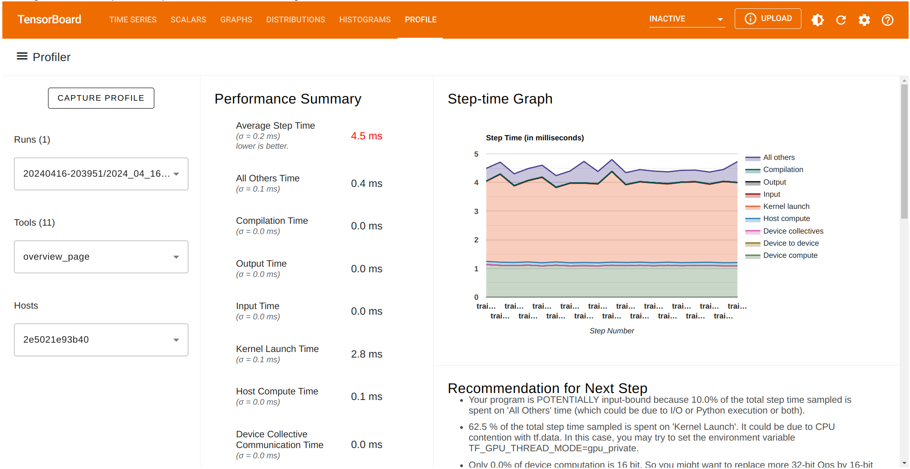
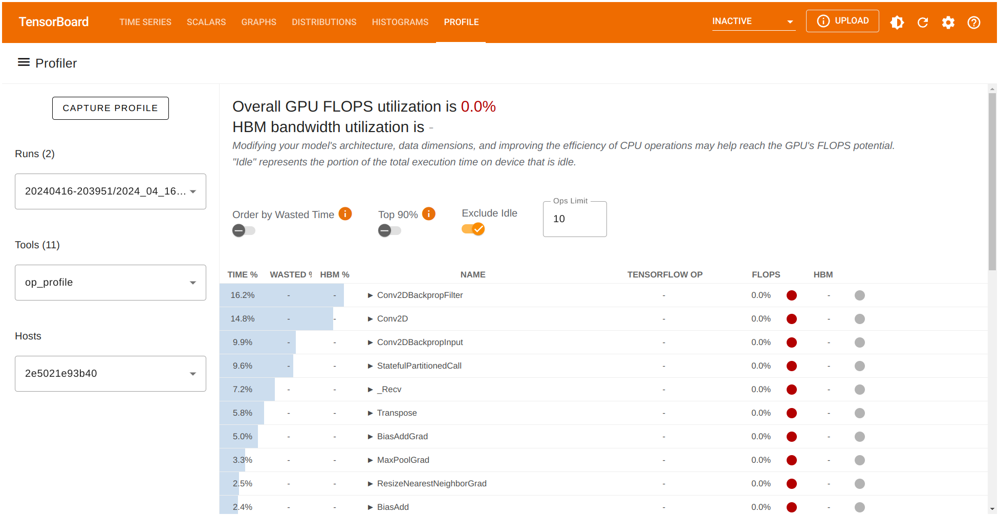

# TensorFlow Profiler in practice: Optimizing TensorFlow models on AMD GPUs

## Introduction

TensorFlow Profiler consists of a set of tools designed to measure resource utilization and performance during the execution of TensorFlow models. It offers insights into how a model interacts with hardware resources, including execution time and memory usage. TensorFlow Profiler helps in pinpointing performance bottlenecks, allowing us to fine-tune the execution of models for improved efficiency and faster outcomes which can be crucial in scenarios where near-real-time predictions are required.

Machine learning algorithms, particularly deep neural networks, have high computational requirements. It's crucial to assess the performance of a machine learning application to ensure that the most optimized version of a model is being executed. This blog demonstrates how to use the TensorFlow Profiler tool on AMD hardware through an example of training an autoencoder model, collecting device traces, and modifying the autoencoder's architecture based on the analysis of the profiler data. For more information about TensorFlow Profiler, see [Optimize TensorFlow using the Profiler](https://www.tensorflow.org/guide/profiler).

Find the resources related to this blog post in the
[GitHub folder](https://github.com/ROCm/rocm-blogs/tree/release/blogs/software-tools-optimization/tf_profiler).

## Prerequisites

These are the requirements and instructions needed to follow along with this blog:

### OS and hardware

The following describes the supported OS and hardware environment recommended to run the examples in this blog post.

* AMD accelerator or GPU: Refer to the list of supported operating systems and hardware in ROCm documentation at [System requirements (Linux)](https://rocm.docs.amd.com/projects/install-on-linux/en/latest/reference/system-requirements.html).

* ROCm 6.0: Refer to [ROCm installation instructions](https://rocm.docs.amd.com/projects/install-on-linux/en/latest/index.html).

* Docker: Use [Docker engine for Ubuntu](https://docs.docker.com/engine/install/ubuntu/#install-using-the-repository).

* TensorFlow and TensorBoard: Use the official ROCm Docker image [rocm/tensorflow:rocm6.0-tf2.12-runtime](https://hub.docker.com/layers/rocm/tensorflow/rocm6.0-tf2.12-runtime/images/sha256-2f29c30dadf00e79217311e2c86863b5a395dfe766a33e8e1ca2a0f3399f1095?context=explore) with TensorFlow 2.12 support.

### Running this blog

Using Docker is the easiest and most reliable way to set up the required environment.

* Ensure that Docker is installed. If not, refer to the [installation instructions](https://docs.docker.com/get-docker/).

* Ensure that `amdgpu-dkms` is installed (which comes with ROCm) on the host to access GPUs from inside Docker. See the [ROCm Docker instructions](https://rocm.docs.amd.com/projects/install-on-linux/en/latest/how-to/docker.html) for more information.

* Clone the repo, and `cd` into the blog directory:

    ```shell
    git clone https://github.com/ROCm/rocm-blogs.git
    cd rocm-blogs/blogs/software-tools-optimization/tf_profiler
    ```

* Build and start the container. For details on the build process, see the `dockerfile`. This will start a Jupyter Lab server.

    ```shell
    cd docker
    docker compose build
    docker compose up
    ```
  
* Navigate to http://localhost:8888/lab/tree/src/tf_profiler_ae_example.ipynb in your browser and open the `tf_profiler_ae_example.ipynb` notebook.

Now, follow along with this blog using the Jupyter notebook.

## Recording profiling data using TensorFlow Profiler

In the following sections, we will design and train a simple autoencoder model on the MNIST dataset while collecting profiling data using TensorFlow Profiler. By analyzing this profiling data in TensorBoard, we'll identify performance bottlenecks and make informed decisions to optimize the model's performance on AMD accelerators.

### Designing a simple autoencoder

An autoencoder is a type of neural network used in unsupervised learning, designed to learn efficient representations of input data. Autoencoders are commonly used for tasks such as dimensionality reduction or feature learning. They consist of two main parts: the **encoder** which compresses the input into a latent space representation, and the **decoder** which reconstructs the input data from the latent representation. The goal is to minimize the difference between the original input and its reconstruction, thus enabling the model to learn salient features of the data without supervision.

We will train the autoencoder using the `MNIST` dataset. The `MNIST` dataset is a large set of handwritten digits that is commonly used for training various image processing systems. `MNIST` is part of the `tensorflow_datasets` module and is included with the TensorFlow installation. For the autoencoder, the goal is to have it learn a compact representation of the handwritten digits in the `MNIST` dataset.

To showcase the benefits of TensorFlow Profiler, let's design the autoencoder neural network as follows:

Start importing the following modules:

```python
import os
import tensorflow as tf
import tensorflow_datasets as tfds
from tensorflow.keras.layers import Input, Conv2D, MaxPooling2D, UpSampling2D
from tensorflow.keras.models import Model
from tensorflow.keras.callbacks import TensorBoard

from datetime import datetime
```

Next, load the dataset and perform a pre-process operation: normalize each image to be in $[0,1]$ range on each image.

```python
# Load the dataset

def preprocess_image(features):

    image = tf.cast(features['image'], tf.float32) / 255.0
    image = tf.image.resize(image, [28,28])
    image = tf.expand_dims(image[:, :, 0], -1)

    return image, image # Returns input and output the same for the autoencoder

# Create mnist train and test splits
ds_train = tfds.load('mnist', split='train', as_supervised=False)
ds_train = ds_train.map(preprocess_image, num_parallel_calls = tf.data.AUTOTUNE).batch(64)

ds_test = tfds.load('mnist', split='test', as_supervised=False)
ds_test = ds_test.map(preprocess_image, num_parallel_calls = tf.data.AUTOTUNE).batch(64)
```

Let's define the following autoencoder architecture:

```python
# Define architecture
input_img = Input(shape = (28,28,1))

# Encoder section
x = Conv2D(512,(3,3), activation = 'relu', padding = 'same')(input_img)
x = MaxPooling2D((2,2), padding = 'same')(x)
x = Conv2D(128, (3,3), activation = 'relu', padding = 'same')(x)
encoded = MaxPooling2D((2,2), padding='same')(x)

# Decoder section
x = Conv2D(128,(3,3), activation = 'relu', padding = 'same')(encoded)
x = UpSampling2D((2,2))(x)
x = Conv2D(512,(3,3), activation = 'relu', padding = 'same')(x)
x = UpSampling2D((2,2))(x)
decoded = Conv2D(1,(3,3), activation='sigmoid', padding='same')(x)

autoencoder = Model(input_img, decoded)
```

Finally, set up the profiling callback to collect profiling data while the model is trained.

```python
# Define the optimizer and loss function
autoencoder.compile(optimizer = 'adam', loss = 'binary_crossentropy')
 
# Setup for profiling. Store profiling logs on the respective folder
tensorboard_callback = TensorBoard(log_dir = './logs/' + datetime.now().strftime("%Y%m%d-%H%M%S"),
                                   histogram_freq=1, profile_batch='500,520')

# Train the model for 10 epochs
autoencoder.fit(ds_train,
                epochs = 10,
                validation_data = ds_test,
                callbacks = [tensorboard_callback], # callback needed for use of tensorboard tools
                )


# Copy file "events.out.tfevents.1583461681.localhost.profile-empty" to each recorded log to display data
source_path = "./events.out.tfevents.1583461681.localhost.profile-empty"
destination_path = log_dir
shutil.copy(source_path, destination_path)
```

> **Note:** In the preceding code, `shutil.copy` is used to copy the file `events.out.tfevents.1583461681.localhost.profile-empty` into the logs folder of the corresponding training run each time. This is a limitation on TensorBoard; it needs this file to be manually placed to display the profiling data correctly and make the `PROFILE` menu available.

In order to explore the use and functionalities of TensorFlow Profiler, we intentionally limited the training of our autoencoder to just 10 epochs. Let's run the following to visualize the autoencoder's output.

```python
# Show the images

import matplotlib.pyplot as plt
import numpy as np
import tensorflow_datasets as tfds

# Extract a single test image
for test_images, _ in ds_test.take(30): # get image with index 30
    test_image = test_images[0:1]

reconstructed_image = autoencoder.predict(test_image)

# Plot original image
fig, axes = plt.subplots(1,2)
axes[0].imshow(test_image[0,:,:,0], cmap='gray')
axes[0].set_title('Original Image')
axes[0].axis('off')

# Plot reconstructed image
axes[1].imshow(reconstructed_image[0,:,:,0], cmap='gray')
axes[1].set_title('Reconstructed Image')
axes[1].axis('off')

plt.show()
```

We can compare the autoencoder's input (original image) and its output:



### Exploring TensorFlow Profiler data with TensorBoard

We will use TensorBoard to explore the collected profiling data. TensorBoard is a visualization tool for machine learning experimentation. It helps visualize training metrics and model weights, allowing us to gain a deeper understanding of the model training process.

A useful feature of TensorBoard is the TensorBoard callbacks API. This feature can be integrated into the model training loop to automatically log data such as training and validation metrics. TensorBoard includes a `Profile` option that can be used to profile the time and memory performance of the TensorFlow operations.  This is useful for identifying bottlenecks at training or inference time. Profiling is enabled by setting the `profile_batch` in the TensorBoard callback.

In our case, we create an instance of TensorBoard callback (`tensorboard_callback = TensorBoard()`) with the following parameters:

* `log_dir`: Corresponds to the location where our log data will be stored. In this case, the folder is also appended with the current timestamp: `'./logs/' + datetime.now().strftime("%Y%m%d-%H%M%S")`

* `histogram_freq`: Corresponds to the frequency, in terms of the number of epochs, at which logs are recorded. The value `histogram_freq=1` implies that we are recording data at every epoch.

* `profile_batch`: Configures which batches are profiled. In this case, we defined `profile_batch='500,520'`. This profiles operations from batch $500$ to batch $520$. Since we are using batches of size 64, (`batch(64)`), and the size of the training set is $60,000$ we have $\frac{60000}{64}=938$  batches; thus the `profile_batch='500,520'` range is within the limits for us to profile.

Let's explore our profiler results by visualizing them on TensorBoard.

Start with loading the TensorBoard extension on the Jupyter notebook:

```python
%load_ext tensorboard
```

Next, launch TensorBoard inside the notebook (it might take a few seconds to show up):

```python
%tensorboard --logdir='./logs' --bind_all --port 6006
```

the following screen will be displayed:



To visualize the profile data, go to the `PROFILE` tab where. We will be presented with the following options:

* The current `Run` with the corresponding log folder selected.
* The `Tools` section with the `overview_page` selected.
* The `Hosts` the current CPU or host available at the time of the execution of the TensorFlow code.



The Performance summary contains several performance metrics. It also shows a Step-time graph where the $x$-axis corresponds to the batches (`profile_batch='500,520'`) selected before. Also, TensorFlow Profiler give us a list of potential recommendations that can be implemented for better performance.

TensorBoard provides several tools to better understand the execution of our TensorFlow code. Let's focus on the traces collected on the same training run. Under the `Tools` menu select `trace_viewer`:



The `trace_viewer` option allow us to observe the collected traces on each of the batches (`profile_batch='500,520'`). Inside the trace view, the $x$- axis represents time while the $y$-axis list each of the collected traces on the available devices. Navigate chart using the `A` `D` `W` and `S` keys to move left, right, zoom in, and zoom out respectively.

We can also look for the runtime of any TensorFlow operation and visualize its trace. Let's focus on the batch $500$. In our case, we observe that the operation `Conv2D` on `GPU:1` has a duration of around $475,680$ nanoseconds (ns). According to this chart, this operation consumes most of the processing time. We can also observe the runtime of other GPU operations and the traces recorded on the CPU as well.


### Comparing data from different Profiler runs

So far, we have showcased how to profile and visualize the traces of our autoencoder implementation in TensorFlow. We have also shown how TensorFlow Profiler creates a performance summary of the operations computed during training and even provide us with potential suggestions for better performance. Let's see how the performance summary changes when we make a few changes in our code after following the suggestions provided by the TensorFlow Profiler.

Let's start with exploring the `op_profile` option under the `Tools` menu on the left. This time we observe that `Conv2DBackpropFilter` and `Conv2D` are taking most of the processing time during the training stage. What if we consider a trade-off between the quality of our autoenconder's output (the reconstruction) and reducing number of filters in the `Conv2D` operation to reduce compute time?


Let's modify the number of filters on the enconder and decoder in the corresponding section as follows:

```python
# Encoder
x = Conv2D(16,(3,3), activation = 'relu', padding = 'same')(input_img)
x = MaxPooling2D((2,2), padding = 'same')(x)
x = Conv2D(8, (3,3), activation = 'relu', padding = 'same')(x)
```

and similarly, for the decoder:

```python
# Decoder
x = Conv2D(8,(3,3), activation = 'relu', padding = 'same')(encoded)
x = UpSampling2D((2,2))(x)
x = Conv2D(16,(3,3), activation = 'relu', padding = 'same')(x)
```

We have modified the number of filters in the `encoder` from the original $512$ to $16$ and also from $128$ to $8$ in the respective `Conv2D` convolutional layers. Since the `decoder` architecture mirrors that of the `encoder`, the reciprocal is also done on the `decoder` portion. Let's compare the input, our previous autoencoder's output and the output of the new updated autoencoder:


In the unoptimized and optimized reconstructions, we don't see much of a visual difference between either autoencoder's reconstructions.

Check TensorFlow Profiler's recorded data of this updated run.



Let's also check the percentage of time being used in the `Conv2D` computations.



Great! The profiler tool allowed us to identify a potential bottleneck in our model stemming from the `Conv2D` operation. If we consider a trade-off between some loss of quality in the output for a reduced computation time we can achieve a better performance our training pipeline.

## Summary

Tensorflow Profiler is an essential tool for enhancing computations with deep neural networks. It offers detailed insights for optimizing TensorFlow models, particularly demonstrating the substantial benefits of utilizing AMD's GPU capabilities. This setup ensures faster machine learning computations, making AMD GPUs an excellent choice for advanced TensorFlow applications.

## Disclaimers

Third-party content is licensed to you directly by the third party that owns the content and is not licensed to you by AMD. ALL LINKED THIRD-PARTY CONTENT IS PROVIDED “AS IS” WITHOUT A WARRANTY OF ANY KIND. USE OF SUCH THIRD-PARTY CONTENT IS DONE AT YOUR SOLE DISCRETION AND UNDER NO CIRCUMSTANCES WILL AMD BE LIABLE TO YOU FOR
ANY THIRD-PARTY CONTENT. YOU ASSUME ALL RISK AND ARE SOLELY RESPONSIBLE FOR ANY
DAMAGES THAT MAY ARISE FROM YOUR USE OF THIRD-PARTY CONTENT.
